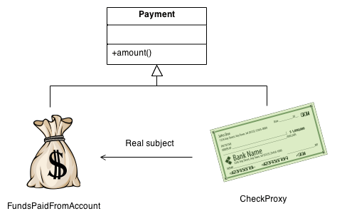

## Hidden Intent

In the complex nature of software design, there are common problems that reoccur with solutions that can be repeatedly used to address them. Design patterns are these repeatable solutions, and they can be classified according to their intent.

* Creation
* Structure
* Behavior

Design patterns with the intent of creation address how objects are created in code. Ideally, these objects are made flexible for use and utilize abstraction. If this sounds familiar, these are principles of object-oriented programming. Creational design patterns help programmers build programs that are adaptable, reusable, and maintainable.

Design patterns with the intent of affecting structure, address the structure of objects and classes. To better explain structural design patterns, I will share examples. The Proxy Pattern allows a programmer to create an object that can act as an intermediary between the user and a target object. This proxy object adds functionality to the target object without changing the target’s interface; adding flexibility, adaptability, and easier maintainability.

Design patterns with the intent of affecting behavior, address how objects and classes interact with each other. Behavioral design patterns include the Iterator Pattern, which lets an iterator traverse the elements of a collection of objects without accessing its implementation. Again, allowing for adaptable programming.

## Usage

Patterns exist within programs to solve intricate problems. The examples of design patterns that I have explained were part of my own code. In a previous ICS course that focused on C and C++, I have used a Proxy class to serve as a placeholder. In multiple courses, I have used an Iterator class to iterate through data.

I had read that design patterns are discovered and named by programmers. As programmers, we use design patterns to create optimized code. But, I can channel the ideology of a meme- the scene between Gojo and Geto- to rephrase this sentence: “Design patterns use programmers.”

## Credits

I used AI to reference flexibility and abstraction in object creation. Primarily, I referenced this (LinkedIn article)[https://www.linkedin.com/pulse/7-design-patterns-you-should-know-hayk-simonyan/] and (StackExchange post)https://softwareengineering.stackexchange.com/questions/141854/design-patterns-do-you-use-them.
