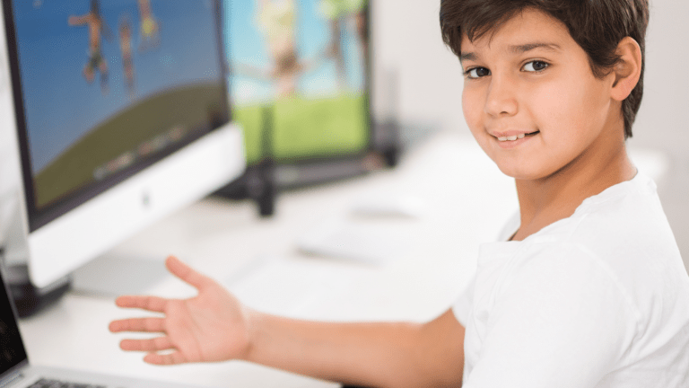

## It began

As a child growing up in the early 2000’s, technology was the easiest way for my busy parents to keep me entertained. I would be invested in shows streamed on television or in apps on a tablet (anyone remember Pokémon TV). Then I would be introduced to games from my friends, which I accessed on a computer (I was an Animal Jam kid) or a phone (mobile games or virtual pet sites if you know them). 

Virtual pet sites, in particular, inspired me. I was fascinated with how a 2D website could be curated to feel like a 3D landscape. The devs would include annual events that added new character interactions on a whole separate page never seen before, with new interactive features designed to cleverly earn event tokens and prizes. Ever since, I became enamored with interactive media.

## The beginning

Virtual pet sites did more than just bewilder my young mind. It provided me with my first look at coding. These sites provided users with options to customize their posts or to add bios to their pets. The language used for this is BBCode.

When I heard of BBCode, HTML was often mentioned. That is because BBCode is similar to HTML but in a much simpler syntax. My younger self did not really understand the difference, but I familiarized myself with BBCode. I thought it to be synonymous with HTML. When I learned what coding was in middle school and realized that HTML was a programming language, I became determined to pave the way for computer science classes in high school.

## Driving factor

I believe that the will to create comes from the joy of completing past projects. My first computer science course had such a project. It was AP Computer Science Principles, where only a final project was required for your AP score (this was in 2020– the pandemic era). I was restricted to Scratch– having forgotten about my BBCode experience– because it was the only language I was taught in this course. 

Nonetheless, I chose to make a calculator with graphics I designed on MSPaint and an elaborate mix of various if statements and loops. Looking back, my code was inefficient for a calculator since it did not utilize binary to solve mathematical problems in shorter steps. But with the '5' I scored, you can bet that my Scratch calculator could solve simple addition, subtraction, multiplication, and division.

Admittedly, this early success has been one of the major factors that continue to motivate me to become a better software engineer.

## Experiences

Cryptography has become an interest of mine ever since I participated in CyberPatriot during my junior year of high school. CyberPatriot was a national cybersecurity program for JROTC students that included competitions on the regional and national level. It was the first time that my school’s JROTC program offered it, so I took the chance to lead the program.

Starting a team dedicated to learning about cybersecurity was a challenge. For one, not many JROTC students were willing to dedicate after school hours to this extracurricular activity. Many were not interested in cybersecurity. Second, we lacked any tutor to guide our cybersecurity learning experience (this only changed in my senior year). For anyone that decided to stick around, we were forced to be self taught.

I was introduced to CyberStart, a free online cybersecurity course, by my AFJROTC instructor, and after completing all the courses, I found it ingenious how small modifications could alter the entire value of some string. Such a string could be the URL of a website, where a slight misspelling that may seem accidental was actually written with malicious purpose. 

Throughout my time in the program, I was introduced to hidden messages within jpeg images, encrypted in some cipher, and messages that needed to be decrypted for an answer. This aspect of cybersecurity intrigues me to this day.

## Future Aspirations

Programming language development and compiler design are two recent interests of mine that I hope to expand on in the future. Learning a variety of programming languages made me wonder what the process behind developing an entire language would be. On the other hand, the compiler is a crucial aspect of running a program, so I also grew curious about how a compiler is developed, especially with how consideration is given to the variety of existing languages that a programmer would use.

I believe these two interests will be crucial to the future of software development and to strive for better programs. I hope to be able to develop the skills to contribute to these two subfields of computer science.
