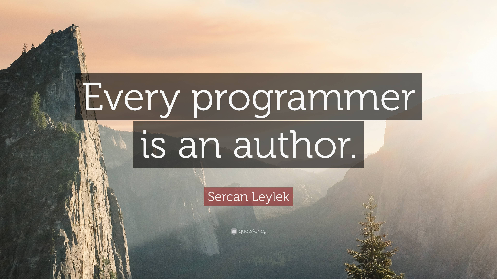

## Lessons from the ICS 314 Course

At UH Manoa, the ICS 314 course is called Software Engineering I. It is considered the introductory course to *software engineering* but why is that? This first course in Software Engineering focuses on the development of web applications with the use of a minimal technology stack. As of the Fall 2024 catalog, this “minimal” stack included Typescript, git, markdown, VSCode IDE, GitHub, ESLint, HTML, CSS, Bootstrap 5, React, PostgreSQL, Prisma ORM, Nextjs, and Vercel. The focus of utilizing a focused set of tools is to acquire competency in using specific **development environments** and to make effective use of an IDE (integrated development environment) with **coding standards**. These two fundamental software engineering concepts are crucial lessons from this course, and as an amateur, I will elaborate on why I believe that these two concepts are so important.

## Development Environments in ICS 314

In the ICS 314 course, we focused on the Visual Studio Code (VSCode) IDE for creating and modifying source code. Our module for **development environments** involved the installation of VSCode and growing familiarity with creating Typescript projects in VSCode. This is in regards to the web application development aspect of the course. Beyond application, this topic involves a software development tool with useful properties to a software developer.

### What is an IDE? Why use an IDE?

An integrated development environment is a software development tool with advanced capabilities for manipulating source code through its feature of recognizing the coding language that is used, recognizing the complexities of a system’s file structure, supporting integrated compilation (connecting different steps of compiling a program as one coordinated workflow), and to be able to execute one line of code at a time for debugging. 

Although IDEs are more complex to use in the way that it takes time to learn and to launch an IDE, it is more rewarding for novice developers like myself to use an IDE. It is faster to use an IDE to manipulate large software systems with numerous lines of code because IDEs help provide information about the system that helps a developer understand, improve on, and correct code as needed. In the industry, IDEs are considered an acceptable editor for writing software.

## Coding Standards in ICS 314

In the ICS 314 course, we focused on incorporating ESLint into our use of VSCode IDE. Our module for **coding standards** directly followed the previous concept of development environments, because both of these two concepts are intertwined. To use an IDE effectively, we have to understand how to demonstrate good practices for writing Typescript with our previous knowledge of Javascript. To do so, we were to install ESLint to help improve our code quality and practice using ESLint to fix bad Typescript. This is in regards to the web application development aspect of the course. Beyond application, this topic involves becoming a better software developer through the use of good coding practices.

### What are coding standards? Why use coding standards?

Coding standards refer to a “common” set of good coding practices similar to how proper English grammar has developed— through constant use of a language! Coding standards affect the quality of a developer’s software similar to how a novel is affected by an author’s effective use of the English language. It is important to enforce standards for how my code will appear and how it will be written first and foremost, because only then will the quality of my code be improved. The readability of my code will improve by establishing coding standards, which would then help me later with recognizing and debugging errors. My software could scale beyond just me, myself, as the sole developer should everyone implement the same coding standards. Then, regardless of who wrote the code, the system will maintain the same code quality by sharing the same writing fashion.

It is almost impossible to enforce coding standards without the use of a tool to automate these checks. It is unreliable to rely on human checks for maintaining the same coding standards. As a result, we focused on running ESLint to help enforce proper coding etiquette in this course. As an example, ESLint would flag a spacing error in copied and pasted code if it does not match the expected spacing requirements based on previous or subsequent lines of pre-existing code. Although the squiggly red underscores are annoying to the tired software developer, fixing code that did not fit the standard is the same as fixing a misspelled word on a Word document. It is simple to fix, and it should be done so for clarity.
