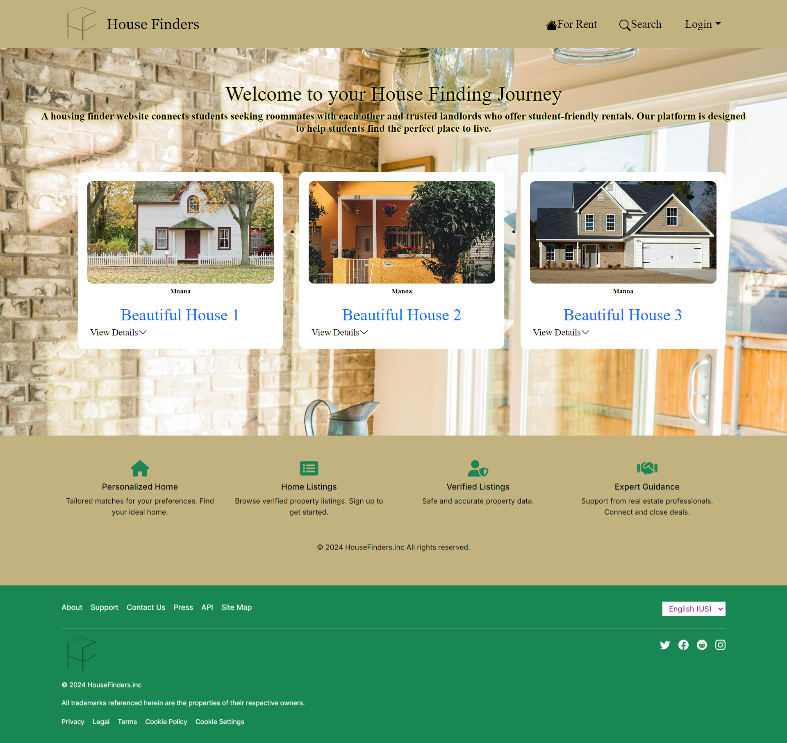
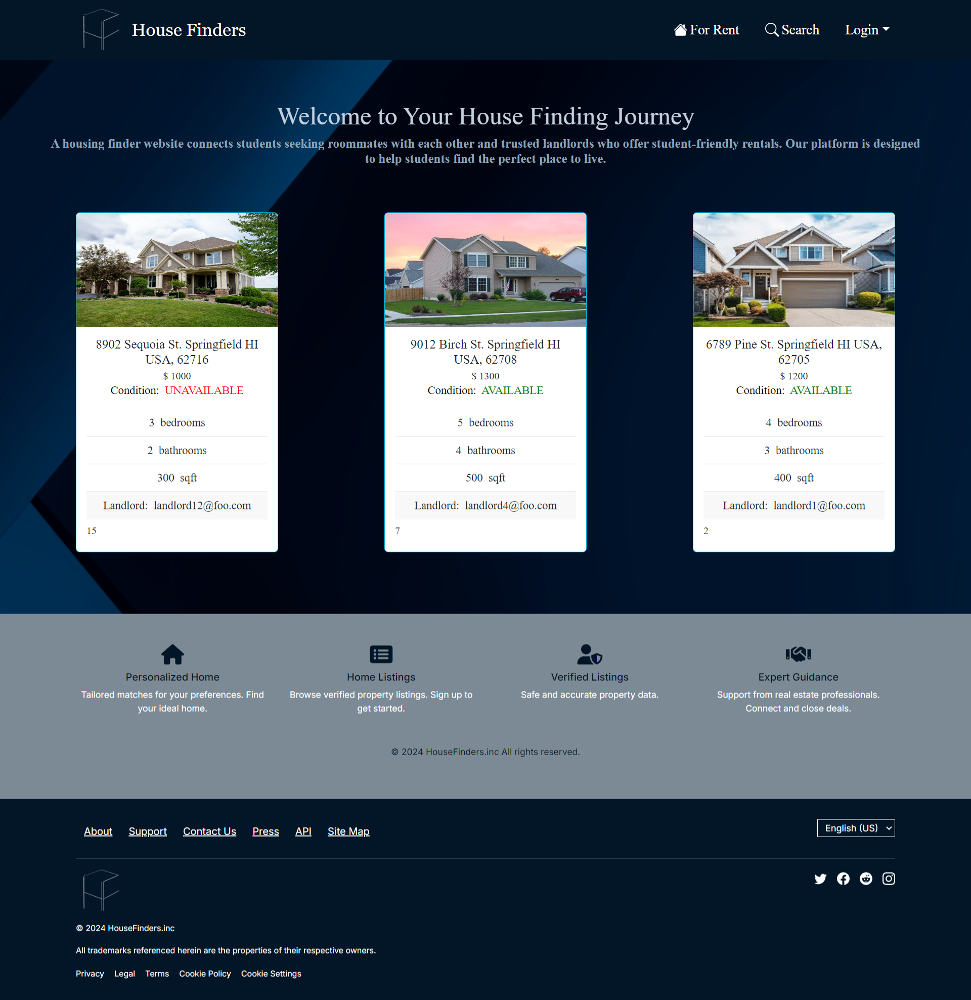

House Finders was completed as the final project for our ICS 314 course. We founded our own groups of up to five students, and my group chose to take on the option to propose our own project idea. A housing finder website was my idea for our group project– the project proposal can be read [here](https://kngcr.github.io/essays/housing-finder.html). We were suggested to use one of our previous class projects as a template, which we had chosen to do so with [Digits](https://courses.ics.hawaii.edu/ics314f24/modules/nextjs-3/). The duration of this project was around a month long, and we were required to submit three weekly milestone projects to indicate our continued progress.

For this project, my main contribution was the styling of our website. I designed the website’s logo and the background image, the latter of which was inspired by [this stock image](https://as1.ftcdn.net/v2/jpg/03/91/46/10/1000_F_391461057_5P0BOWl4lY442Zoo9rzEeJU0S2c1WDZR.jpg). I modified our site’s primary font to be in Merriweather. Over the course of this project, all of our page components had separate in-line CSS styles. This meant that the task of applying the same styles for font, size, color, padding, etc. became rather tedious by the end of our project.

Although I could recall learning about implementing all CSS styling from one shared .css file, I learned that it is difficult to do so when every person writes code differently. Not only do coding preferences differ, but there is also the challenge of working with	a live project. We had to admit which issues were reasonable to complete within each week’s milestone, and which issues to push back. Ideas have also risen and fallen through.

As an example, our website’s appearance had drastically changed at the last minute for our third and final milestone. Below, I show a picture of the old landing page and then, the new landing page.

  

  

You can view the source code at [House Finders](https://github.com/house-finders/house-finders).
